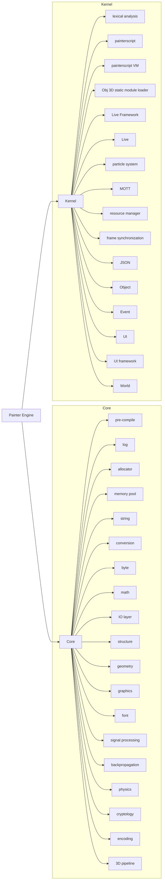

# Python Wrapper for *Painter Engine*

Possibly a Python Wrapper for [Painter Engine](https://github.com/matrixcascade/PainterEngine), if I have enough time to spend for.

According to Its [API](https://www.painterengine.com/manual.html), which written in Chinese and have no English translation, it seems to be an algorithm soup consists of following parts:

Most of the *Core* are reinvented wheels, ignoring [glib](https://github.com/GNOME/glib). However, compared to glib, this will take less time to wrap and will be a better practice.
